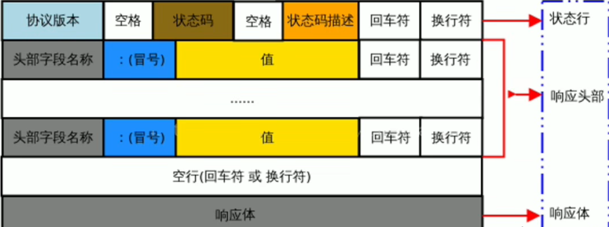

[TOC]

# 一、服务器基本概念

## 1. 客户端与服务器

上网的本质目的: 通过互联网的形式来**获取和消费资源**

**(1) 服务器**:

上网过程中，负责**存放和对外提供资源**的电脑，叫做服务器。


**(2) 客户端**:

上网过程中，**负责获取和消费资源**的电脑，叫做客户端。

## 2. URL地址

URL(全称是UniformResourceLocator)中文叫**统一资源定位符**，用于标识互联网上每个资源的唯一存放位置。浏览器只有通过URL地址，才能正确定位资源的存放位置，从而成功访问到对应的资源。

**URL地址的组成部分**:

URL地址一般由三部组成:

①客户端与服务器之间的**通信协议**

②存有该资源的**服务器名称**

③资源在服务器上**具体的存放位置**


## 3. 网页打开过程

(1)**客户端与服务器的通信过程为**：

- 客产端与服务器之间的通信过程，分为==请求-处理-响应==三个步骤。
- 网页中的每一个资源，都是通过请求-处理一响应的方式从服务器获取回来的。

(2)**开发者工具中观测通信过程**：

在网页开发者工具中点击 **network** 面板 在选中**Doc**标签

## 4. 服务器对外提供的资源

**(1)网页中常见的资源**

文字、图片、音频、视频、**数据**。

**(2) 数据资源**

网页中的数据，也是服务器对外提供的一种资源。例如股票数据、各行业排行榜等。

### 4.1 网页中如何请求数据

数据：是服务器对外提供的一种资源。只要是资源，必然要通过请求–处理–响应的方式进行获取。

如果要在网页中请求服务器上的数据资源，则需要用到==XMLHttpRequest==对象。

XMLHttpRequest(简称xhr）是浏览器提供的js 成员，通过它，可以请求服务器上的数据资源。

==语法==：

```javascript
 var xhrQbj = new XMLHttpRequest();
//使用xhrQbj就可以发起数据请求
```

### 4.2 资源的请求方式

客户端请求服务器时，请求的方式有很多种，最常见的两种请求方式分别为**get**和**post**请求。

**get**请求通常用于获取服务端资源（向服务器要资源)

- 例如:根据URL地址，从服务器获取HTML文件、css文件、js文件、图片文件、数据资源等

**post** 请求通常用于向服务器提交数据(往服务器发送资源)

- 例如:登录时向服务器提交的登录信息、注册时向服务器提交的注册信息、添加用户时向服务器提交的用户信息等各种数据提交操作

## 5.  Ajax 基本概念

**(1)什么是Ajax**:

Ajax的全称：Asynchronous Javascript And XML (异步JavaScript和XML).

在网页中利用XMLHttpRequest对象和服务器进行数据交互的方式，就是Ajax。


**(2)Ajax的作用**:

Ajax能让我们轻松实现**网页**与**服务器**之间的==数据交互==。


**(3) Ajax的典型应用场景**

用户名检测 : 注册用户时，通过ajax的形式，**动态检测用户名是否被占用**

搜索提示 : 当输入搜索关键字时，通过ajax的形式，**动态加载搜索提示列表**

数据分页显示 : 当点击页码值的时候，通过ajax的形式，根据页码值**动态刷新表格的数据**

数据的增删改查 : 数据的添、删、改、查操作，需要通过ajax的形式，来**实现数据的交互**

## 6. 接口

### 6.1 接口的概念与工具

**(1) 接口的概念**

使用Ajax请求数据时，**==被请求的URL地址==，叫做数据接口（简称接口)**。同时，**每个接口必须有请求方式**。

http://www.liulongbin.top:3006/api/getbooks 获取图书列表的接口(GET请求)

http://www.liulongbin.top:3006/api/addbook 添加图书的接口(POST请求)


**(2)接口测试工具**

为了验证接口能否被正常被访问，常常使用接口测试工具，来对数据接口进行检测。

好处 : 接口测试工具能让在**不写任何代码**的情况下，对接口进行调用和测试。

apipost：https://console.apipost.cn/

### 6.2 接口文档

接口文档：接口的说明文档，它是我们调用接口的依据。

接口文档包含了对接口URL，参数以及输出内容的说明，参照接口文档就知道接口的作用，以及接口如何进行调用。

**(1)接口文档的组成部分**：

接口文档可以包含很多信息，也可以按需进行精简，不过，一个合格的接口文档，应该包含以下6项内容，从而为接口的**调用提供依据**：

- **接口名称**:用来标识各个接口的简单说明，如登录接口，获取图书列表接口等。
- **接口URL**:接口的调用地址。
- **调用方式**:接口的调用方式,如GET 或 POST.
- **参数格式** : 接口需要传递的参数，每个参数必须包含参数名称、参数类型、是否必选、参数说明这4项内容。
- **响应格式**:接口的返回值的详细描述，一般包含数据名称、数据类型、说明3项内容。
- **返回示例**(可选):通过对象的形式，例举服务器返回数据的结构。

例子：


# 二、 jQuery中的Ajax

浏览器中提供的XMLHttpRequest用法比较复杂，所以jQuery对 XMLHttpRequest进行了封装，提供了一系列 Ajax相关的函数，极大地降低了Ajax的使用难度。

jQuery中发起 Ajax请求最常用的三个方法如下: 

- **$.get( )**
- **$.post( )**
- **$.ajax( )**

## 1. $.get()函数发起get请求

jQuery 中 $.get()函数的功能单一，专门用来发起get 请求，从而将服务器上的资源请求到客户端来进行使用。

==语法==：

```javascript
$.get(url,[data],[callback]);
```

==参数说明==：

| 参数名   | 参数类型 | 是否必选 | 说明                     |
| -------- | -------- | -------- | ------------------------ |
| url      | string   | 是       | 要请求的资源地址         |
| data     | object   | 否       | 请求资源期间要携带的参数 |
| callback | function | 否       | 请求成功时的回调函数     |

**注**：所有的ajax所有的请求都可以通过**Network**中的**XHR**来查看

### 1.1 $.get()函数发起不带参数的请求

使用$.get()函数发起不带参数的请求时，**直接提供请求的URL地址和请求成功之后的回调函数**即可

```javascript
$.get('http://www.liulongbin.top:3006/api/getbooks',function(res){
    console.log(res)//这里的res是服务器返回的数据
})
```

### 1.2 $.get()函数发起带参数的请求

```javascript
$.get('http://www.liulongbin.top:3006/api/getbooks',{id:1},function(res){
    console.log(res)//这里的res是服务器返回的数据
})
```

## 2. $.post()函数

jQuery 中 $.post()函数的功能单一，专门用来发起post请求，从而向服务器提交数据。

==语法==：

```javascript
$.post(url,[data],[callback]);
```

| 参数名   | 参数类型 | 说明                     |
| -------- | -------- | ------------------------ |
| url      | string   | 提交数据的地址           |
| data     | object   | 要提交的数据             |
| callback | function | 数据提交成功时的回调函数 |

例子：

```javascript
   <button id="btnGET1">发起post请求</button>
    <script>
        $(function () {
            $("#btnGET1").on('click', function () {
                $.post('http://www.liulongbin.top:3006/api/addbook', {
                    id:6,
                    bookname:'水浒传ghg',
                    author:'施耐庵dfs',
                    publisher:'天津出版社dsfsd'
                },function(res){
                    console.log(res);
                })
            })
        })
    </script>
```

结果：


## 3. $.ajax()函数

jQuery 中提供的$.ajax()函数，是一个功能比较综合的函数，它允许我们对Ajax请求进行更详细的配置。

==语法==：

```javascript
$.ajax({
    type:'',// 请求的方式，例如GET 或POST
    url:'', // 请求的URL 地址
    data:{}, //这次请求要携带的数据
    success:function(res){}// 请求成功之后的回调函数
})
```

### 3.1  使用$.ajax()发起GET请求

使用$.ajax()发起 GET请求时，只需要将type属性的值设置为'GET，即可:

例子：

```javascript
$.ajax({
    type:'GET',// 请求的方式，例如GET 或POST
    url:'http://www.liulongbin.top:3006/api/getbooks', // 请求的URL 地址
    data:{id:1}, //这次请求要携带的数据
    success:function(res){
        console.log(res);
    }// 请求成功之后的回调函数
})
```

结果：


### 3.2 使用$.ajax()发起post请求

使用$.ajax()发起 GET请求时，只需要将type属性的值设置为'GET，即可:

例子：

```javascript
 $("#btnGET2").on('click', function () {
                $.ajax({
                    type: 'POST',
                    url: 'http://www.liulongbin.top:3006/api/addbook', 
                    data: {
                        id: 8,
                        bookname: '水浒传aghg',
                        author: '施耐庵dfs',
                        publisher: '天津出版社dsfsd'
                    },
                    success: function (res) {
                        console.log(res);
                    }
                })
            })
```

结果与$.post相同

# 三、form表单与模板引擎

## 1.form表单的基本使用

**(1)表单**：表单在网页中主要负责**数据采集功能**。HTML中的< form>标签，用于采集用户输入的信息，并通过< form>标签的提交操作，把采集到的信息提交到服务器端进行处理。


**(2)表单的组成部分**：

- 表单标签
- 表单域 : 包含了文本框、密码框、隐藏域、多行文本框、复选框、单选框、下拉选择框和文件上传框等。
- 表单按钮


**(3)提交行为**

提交事件并不是来自于属性为submit的按钮，而是来自于form表单，所以添加监听事件时，时监听form的提交(submit)事件

### 1.1 < from> 标签的属性

< form>标签用来采集数据，< form>标签的属性则是用来规定**如何把采集到的数据发送到服务器**。

| 属性    | 值                                                           | 说明                                     |
| ------- | ------------------------------------------------------------ | ---------------------------------------- |
| action  | URL地址                                                      | 规定当提交表单时，向何处发送表单数据     |
| method  | get(默认) 或 post                                            | 规定以何种方式把表单数据提交到action URL |
| enctype | application / x-www-form-urlencoded:在发送前编码所有字符.<br>multipart / form-data：不对字符进行编码，在使用包含文件上传控件的表单时，必须使用该值.<br>text / plain:空格转换为“ + ” 加号，但不对特殊字符编码(很少用). | 规定在发送表单数据之前如何对其进行编码   |
| target  | _ blank: 在新窗口中打开<br>_ self : 默认，在相同的框架中打开<br/>_ parent: 在父框架集中打开(很少用)<br/>_ top: 在整个窗口中打开(很少用)<br/>_ framename: 在指定的框架中打开(很少用) | 规定在何处打开 action URL                |

**(1) action属性**

action属性用来规定当提交表单时，向何处发送表单数据。

action属性的值应该是后端提供的一个URL地址，这个URL地址专门负责接收表单提交过来的数据。

当< form>表单在**未指定action 属性值**的情况下，action的默认值为**当前页面的URL地址**。

**注意**：<span style="color:red">当提交表单后，页面会立即跳转到action 属性指定的URL地址</span>.


**(2) target属性**

target属性用来规定**在何处打开 action URL**.

它的可选值有5个，默认情况下， target的值是 self，表示在相同的框架中打开action URL。


**(3) method属性**

method 属性用来规定以**何种方式**把表单数据**提交**到action URL。

默认情况下，method 的值为get，表示通过URL地址的形式，把表单数据提交到 action URL.

**注意**：

<span style="color:red">get ：方式适合用来提交少量的、简单的数据 ( 因为会在上方地址栏中显示提交的数据 ) 。<br> post：方式适合用来提交大量的、复杂的、或包含文件上传的数据</span>.


**(4) enctype属性**

enctype属性用来规定在**发送表单数据之前如何对数据进行编码**。

它的可选值有三个，默认情况下，enctype 的值为 application/x-www-formiurlencoded，表示在发送前编码所有的字符。

**注意**：在<span style="color:red">涉及到文件上传的操作时，必须将enctype的值设置为multipart/form-data</span>.


### 1.2 表单的同步提交及弱点

**(1)什么是表单的同步提交**

通过点击submit 按钮，触发表单提交的操作，从而使页面跳转到action URL的行为，叫做表单的同步提交。


**(2) 表单同步提交的缺点**

1.  < form>表单同步提交后，整个页面会发生跳转，**跳转到action URL所指向的地址**，用户体验很差。
2.  < form>表单同步提交后，**页面之前的状态和数据会丢失**。


**(3) 如何解决表单同步提交的缺点**

<span style="color:red">让表单只负责采集数据，由Ajax负责将数据提交到服务器</span>。


## 2. 通过ajax提交表单数据

### 2.1 监听表单提交事件

在 jQuery中，可以使用如下两种方式，监听到表单的提交事件:

```javascript
$("#form1").submit(function(e){
    alert("监听到了表单的提交事件");
})//这种方式基本不用

$("#form2").on('submit',function(e){
    alert("监听到了表单的提交事件");
})
```

### 2.2 阻止表单的默认提交行为

当监听到表单的提交事件以后，可以调用事件对象的**event.preventDefault()**函数，来阻止表单的提交和页面的跳转，示例代码如下:

```javascript
$("#form2").on('submit',function(e){
    alert("监听到了表单的提交事件");
    e.preventDefault()
})
```

### 2.3 快速获取表单中的数据

#### 2.3.1 serialize()函数

简化的表单中数据的获取操作。jQuery提供了**serialize()**函数

==语法==：

```javascript
$(select).serialize();
```

作用：**可以一次性获取到表单中的所有的数据**。


例子：

```html
<form id="form1">
    <input type="text" name="username">
    <input type="password" name="password">
    <button type="submit">提交</button>
</form>
<script>
$('#form1').serialize()
</script>
<!-- 调用结果为以键值对形式返回的字符串:username=用户名的值&password=密码的值

<!-- 假设输入的值为  她  123456 -->
<!-- user_name=%E5%A5%B9&password=123456 -->
```

注意：在使用serialize0函数快速获取表单数据时，<span style="color:red">必须为每个表单元素添加name属性</span> , 否则就无法正常获取到值!

## 3. 模板引擎的基本概念

**(1) 渲染UI结构时的问题**

```javascript
   var rows = []
      $.each(res.data, function (i, item) {
        var str = '<li class="list-group-item"><span class="badge" style="background-color: #F0AD4E;">评论时间：' + item.time + '</span><span class="badge" style="background-color: #5BC0DE;">评论人：' + item.username + '</span>' + item.content + '</li>'
        rows.push(str);
        $('#cmt-list').empty().append(rows.join(''))
      })
```

在以上代码中，是通过**字符串拼接的形式**来渲染UI结构的

如果UI结构比较复杂，则拼接字符串的时候需要格外**注意引号之前的嵌套**。且一旦需求发生变化，**修改麻烦**。


**(2) 什么是模板引擎**

模板引擎：根据程序员**指定的模板结构**和**数据**，自动生成一个完整的HTML页面。

**优点**：

- 减少了字符串的拼接操作
- 使代码结构更清晰
- 使代码更易于阅读与维护

## 4.  art-template模板引擎

使用步骤：

- 导入模板引擎
  - 导入后在window 全局，多一个函数，叫做<span style="color:red"> template(‘模板的Id'，需要渲染的数据对象）</span>.
- 定义模板
  - 模板的HTML结构,必须定义到script中
  -  < script type="text/javascript">中的text/javascript的意思是，将script中的所有代码都当做javascript去解析执行，但模板中需要的html代码，所以需要改为text/javascript

- 调用template函数
- 定义需要渲染的数据
- 渲染html结构

**(1) art-template标准语法**

art-template 提供了{ { } }这种语法格式，在{ { } }内可以进行变量输出，或循环数组等操作，这种  { { } }语法在art-template中被称为标准语法。

==输出==：

```javascript
{{value}}
{{obj.key}}
{{a+b}}
//在{{}}语法中，可以进行变量的输出、对象属性的输出、三元表达式输出、逻辑或输出、加减乘除等表达式输出。
```

==原文输出==：

```javascript
// 如果value='<h3>测试</h3>',想要h3标签被渲染需要按照以下语法
{{@ value}}
//如果要输出的value值中，包含了HTML标签结构，则需要使用原文输出语法，才能保证HTML标签被正常渲染,语法为 在value值前面加上@符号。
```

==条件输出==：

```javascript
{{if value}} 按需输出的内容 {{/if}}

{{if v1}} 按需输出的内容  {{else if v2}} 按需输出的内容  {{/if}}                   
//如果要实现条件输出，则可以在{{}}中使用,if ... else if ... /if 的方式，进行按需输出。
//其中 if表示条件输出的开始，else if 表示其他的判断条件，/if表示条件输出结束
```

==循环输出==：

```javascript
{{each arr}}
{{$index}} {{$value}}
{{/each}}
//如果要实现循环输出，则可以在{{}}内，通过each语法循环数组，当前循环的索引使用$index进行访问,当前的循环项使用$value进行访问，注意值的前面需要加 $ 符号
```

==过滤器的使用==：

```javascript
{{value | filterName}}
// 其中 | 代表要调用某个函数  value 相当于参数 传给 | 左边的函数 filterName(过滤器名称) 并返回一个值
// 过滤器语法类似管道操作符，它的上一个输出作为下一个输入。
// 过滤器的本质，就是一个 function处理函数。
```

==定义过滤器==：

```javascript
template.defaults.import.filterName=function(value){/*return处理的结果*/}
```


## 5. 模板引擎的实现原理

### 5.1 正则与字符串操作

**(1)基本语法**：

exec() 函数 用于**检索字符串**中的正则表达式的匹配。

如果字符串中有匹配的值，则返回该匹配值，否则返回null.

```javascript
RegExpObject.exec(string)
```

例子:

```javascript
var str='hello';
var pattern=/o/;
console.log(pattern.exec(str));
//结果为 ["o",index:4,input:"hello",group:undefined]
```


**(2) 分组**

正则表达式中 ( ) 包起来的内容表示一个分组，可以通过分组来提取自己想要的内容，示例代码如下:

```javascript
var str='<div>我是{{name}}</div';
  //( )表示将内容提取出来，否则只是匹配
 var pattern=/{{([a-zA-Z]+)}}/
 var patternResult=pattern.exec(str)
 console.log(patternResult);
```

结果：

Array(2)

1. **0**: "{{name}}"

2. **1**: "name"

3. **groups**: undefined

4. **index**: 7

5. **input**: "< div>我是{{name}}</div"

6. **length**: 2

7. [[Prototype]]: Array(0)

其中Array(2)中索引号为0的是str中的{{name}},而索引值为1的是分组提取的内容

**(3) 字符串的replace函数**

replace() 函数用于在字符串中用一些字符替换另一些字符，语法格式如下:

```javascript
var result='123456'.replace('123','abc')//得到的result的值为字符串'abc456"
```

例子：

```javascript
var str='<div>我是{{name}}</div';
 var pattern=/{{([a-zA-Z]+)}}/;
 var patternResult=pattern.exec(str);
 str.replace(patternResult[0],patternResult[1]);
console.log(str);
//结果为：我是name
```

==使用循环replace实现多次替换==：

```javascript
  var str = '<div>{{name}}今年{{age}}岁了</div';
  var pattern = /{{\s*([a-zA-Z]+)\s*}}/;
  var patternResult=null;
 // 最后一次替换后 就没有匹配的值了 于是赋patternResult值为null，相当于flase结束循环
  while(patternResult=pattern.exec(str)){
    str=str.replace(patternResult[0],patternResult[1]);
  }
```


==replace替换真值==：

```javascript
  var data = { name: '张三', age: 20 }
  var str = '<div>{{name}}今年{{age}}岁了</div>';
  var pattern = /{{\s*([a-zA-Z]+)\s*}}/;
  var patternResult = null;
  while (patternResult = pattern.exec(str)) {
    str = str.replace(patternResult[0], data[patternResult[1]]);
  }
  //设第一次替换时，patternResult[0]={{name}}，patternResult[1]=name,而对象data中有属性名为name的值，于是data[patternResult[1]]='张三',并成功替换
  console.log(str);
//结果为<div>张三今年20岁了</div>
```

### 5.2 实现简易的模板引擎

**step1: 定义模板结构**

```html
<body>
<script type="text/html" id="tpl-user">
  <div>姓名:{{name}}</div>
  <div>年龄:{{ age }}</div>
  <div>性别:{{  gender}}</div>
  <div>住址:{{address  }}</div>
</script>
</body>
```

**step2: 预调用模块引擎**

```html
<body>
  <div id="user-box"></div> 
<script>
    //定义数据
    var data = {
      name: 'zs',
      age: 28,
      gender: '男',
      address: '北京'
    };
    //调用模板函数
    var htmlStr = template('tpl-user', data);

    //渲染html结构
    document.getElementById('user-box').innerHTML = htmlStr;
  </script>
</body>
```

**step3: 封装template函数**

```javascript
 function template(id, data) {
      //这里通过dom获取了传入了定义的模板结构，并通过innerHTML获取了内容(innerHTML可以识别html标签,并以字符串的形式返回)
      var str = document.getElementById(id).innerHTML;
      var pattern = /{{\s*([a-zA-Z]+)\s*}}/;
      var pattResult = null;
      while (pattResult = pattern.exec(str)) {
        str = str.replace(pattResult[0], data[pattResult[1]]);
      }
      return str;
    }
```


# 四、Ajax进阶

## 1. XMLHttpRequest的基本使用

**什么是XMLHttpRequest：**

XMLHttpRequest(简称xhr)是浏览器提供的Javascript对象，通过它，可以请求服务器上的数据资源。jQuery中的Ajax函数，就是基于xhr对象封装出来的。

### 1.1  使用xhr发起GET请求

步骤：

1. 创建xhr对象
2. 调用xhr.open()函数
3. 调用xhr.send()函数
4. 监听xhr.onreadystatechange事件

例子：

```javascript
    //1. 创建XHR对象
    var xhr = new XMLHttpRequest();
    //2. 调用open函数 指定请求方式与URL地址
    xhr.open('GET', 'http://www.liulongbin.top:3006/api/getbooks')
    //3.调用 send函数 ，发起Ajax请求
    xhr.send();
    //4.监听 onreadystatechange 事件
    xhr.onreadystatechange = function () {
      //4.1 监听xhr对象的 请求状态-readyState 和 与服务器的 响应状态-status
      if (xhr.readyState === 4 && xhr.status === 200) {
        //4.2 打印服务器响应回来的数据
        console.log(xhr.responseText);
      }
    }
   // 打印结果：{"status":200,"msg":"获取图书列表成功","data":[{"id":1,"bookname":"西游记","author":"吴承恩","publisher":"北京图书出版社"},...]
```

 **注意**：

- xhr.status 与打印的"status":200 的 status 不一样，前者是http请求状态的一部分，后者是服务器响应回来的数据中的属性(是数据的一部分)

#### 1.1.1 xhr对象的readyState属性

XMLHttpRequest对象的readyState属性，用来表示**当前Ajax请求所处的状态**。每个Ajax请求必然处于以下状态中的一个:

| 值   | 状态             | 说明                                                        |
| ---- | ---------------- | ----------------------------------------------------------- |
| 0    | unsent           | XMLHttpRequest对象已被创建。但尚未调用open方法。            |
| 1    | opened           | open() 方法已经被调用。                                     |
| 2    | headers_received | send() )方法已经被调用。响应头也已经被接收。                |
| 3    | loading          | 数据接收中，此时response属性中已经包含部分数据。            |
| 4    | done             | Ajax 请求完成。这意味着数据传输已经彻底**完成**或**失败**。 |

#### 1.1.2 使用xhr发起带参数的GET请求

使用xhr对象发起带参数的GET请求时，只需在调用xhr.open期间，为URL地址指定参数即可:

```javascript
//..省略部分代码
xhr.open('GET','http://www.liulongbin.top:3006/api/getbooks?id=1')
//..省略部分代码
//在url地址后面通过 ？的形式为这次GET请求提供了请求的参数
```

### 1.2 查询字符串

**(1) 什么是查询字符串**

定义: 查询字符串(URL参数)是指在URL的末尾加上用于向服务器发送信息的字符串(变量)。

格式 : 将英文的<span style="color:red"> ? 放在URL的末尾，然后再加上 参数=值，想加上多个参数的话，使用 & 符号进行分隔</span>。以这个形式，可以将想要发送给服务器的数据添加到URL中。

例子：

```javascript
//不带参数的URL地址
http://www.liulongbin.top:3006/api/getbooks

//带一个参数的URL地址
http://www.liulongbin.top:3006/api/getbooks?id=1

//带两个参数的URL地址
http://www.liulongbin.top:3006/api/getbooks?id=1&bookname=西游记
```


**(2)GET请求携带参数的本质**

无论使用$.ajax()，还是使用$.get(，又或者直接使用xhr对象发起GET请求，当需要携带参数的时候，本质上，都是直接将参数以查询字符串的形式，追加到URL地址的后面，发送到服务器的。


### 1.3 URL编码与解码

**什么是URL编码：**

- URL地址中，**只允许出现英文相关**的字母、标点符号、数字，因此，在URL地址中**不允许出现中文字符**。
- 如果URL中需要包含中文这样的字符，则**必须对中文字符进行编码**（转义)。
- **URL编码的原则**:
  - 使用安全的字符（没有特殊用途或者特殊意义的可打印字符）去表示那些不安全的字符。

简单理解URL编码就是：使用**英文字符去表示非英文字符**。

#### 1.3.1 如何对URL进行编码和解码

浏览器提供了URL编码和解码的API，分别是：

- encodeURI() 编码的函数
- decodeURI() 解码的函数

例子：

```javascript
console.log(encodeURI('郭'));
//打印结果：%E9%83%AD
console.log(decodeURI('%E9%83%AD'));
//打印结果：郭
```

==注意事项==：

由于浏览器会自动对URL地址进行编码操作，因此，大多数情况下，程序员不需要关心URL地址的编码与解码操作。


### 1.4 使用xhr发起POST请求

==步骤==：

1. 创建xhr对象
2. 调用xhr.open()函数
3. 设置Content-Type属性(固定写法)
4. 调用xhr.send()函数。同时指定要发送的数据
5. 监听xhr.onreadystatechange事件

```javascript
     //1. 创建XHR对象
     var xhr = new XMLHttpRequest();
    //2. 调用open函数 指定请求方式与URL地址
    xhr.open('POST', 'http://www.liulongbin.top:3006/api/addbook')
    //3.设置 Content-Type 属性 (固定写法,且必须写到open调用之后)
    xhr.setRequestHeader('Content-Type','application/x-www-form-urlencoded')
    //4.调用 send函数 ，同时将数据以 查询字符串的形式，提交给服务器
    xhr.send('bookname=水浒传牛&author=施耐庵&publisher=出版社');
    //5.监听 onreadystatechange 事件
    xhr.onreadystatechange = function () {
      //4.1 监听xhr对象的 请求状态-readyState 和 与服务器的 响应状态-status
      if (xhr.readyState === 4 && xhr.status === 200) {
        //4.2 打印服务器响应回来的数据
        console.log(xhr.responseText);
      }
    }
//打印结果：{"status":201,"msg":"添加图书成功"}
```

## 2. 数据交换格式

**什么是数据交换格式:**

数据交换格式，就是**服务器端**与**客户端**之间进行**数据传输与交换的格式**。

前端领域，经常提及的两种数据交换格式分别是XML和JSON。其中XML用的非常少，所以JSON相对重要,

### 2.1 XML

**(1) 什么是XML**

XML的英文全称是EXtensible Markup Language，即**可扩展标记语言**。因此，XML和HTML类似，也是一种标记语言。


**(2) XML和HTML的区别**

XML和HTML虽然都是标记语言，但是，它们两者之间没有任何的关系。

- HTML被设计用来描述网页上的内容，是网页内容的载体
- XML被设计用来传输和存储数据。是数据的载体


**(3) XML的缺点**

```xml
<note>
<to>发送者</to>
<from>接收者</from>
<header>标题</header>
<body>内容</body>
</note>
```

- XML格式臃肿，和数据无关的代码多，体积大，传输效率低
- 在Javascript中解析XML比较麻烦


### 2.2 JSON

概念 : JSON的英文全称是JavaScript Object Notation，即“JavaScript对象表示法”。简单来讲，<span style="color:red">JSON就是Javascript 对象和数组的字符串表示法</span>，它使用文本表示一个JS对象或数组的信息，因此，JSON的本质是字符串。


作用 : JSON 是一种**轻量级的文本数据交换格式**，在作用上类似于XML，专门用于存储和传输数据，但是JSON比XML更小、更快、更易解析。

**(1) JSON的两种结构:**

JSON就是用字符串来表示Javascript的对象和数组。所以，JSON中包含**对象**和**数组**两种结构，通过这两种结构的相互嵌套，可以表示各种复杂的数据结构。

- ==对象结构== : 对象结构在JSON中表示为 { } 括起来的内容。数据结构为{ key: value, key:value....}的键值对结构。其中，<span style="color:red">key必须是使用英文的双引号包裹的字符串</span>，value的数据类型可以是**数字、字符串、布尔值、null、数组、对象**6种类型,**所有的字符串都必须使用==双引号==包裹**。

- ==数组结构== : 数组结构在JSON中表示为 [ ] 括起来的内容。数据结构为[ "java" , "javascript",30, true ...] . 数组中数据的类型可以是**数字、字符串、布尔值、null、数组、对象**6种类型.


**(2) JSON语法注意事项:**

1.  属性名必须使用双引号包裹
2.  字符串类型的值必须使用双引号包裹
3.  JSON中不允许使用单引号表示字符串
4.  JSON中不能写注释
5.  JSON的最外层必须是对象或数组格式
6.  不能使用undefined或函数作为JSON的值

**JSON的作用** : 在计算机与网络之间存储和传输数据。

**JSON的本质** : 用字符串来表示Javascript对象数据或数组数据


**(3) JSON和JS对象的关系**:

JSON是JS对象的字符串表示法，它使用文本表示一个JS对象的信息，本质是一个字符串。例如;

```json
//这是一个字符串
var obj={a:'Hello','world'}
/
//这是JSON字符串,本质是字符串
var json='{"a":"hello","b":"world"}'
```

#### 2.2.1  JSON与js对象的互转

要实现从JSON字符串转换为JS对象，使用JSON.parse()方法:

```javascript
var obj=JSON.parse('{"a":"hello","b":"world"}');
//结果是 {a:'hello',b:'world'}
```

要实现从JS对象转换为JSON字符串，使用JSON.stringify()方法:

```javascript
var json=JSON.stringify({a:'hello',b:'world'});
//结果是 '{"a":"hello","b":"world"}'
```

**序列化与反序列化:**

把**数据对象** 转换为 **字符串**的过程，叫做**序列化**，例如:调用JSON.stringify()函数的操作，叫做JSON 序列化。

把**字符串**转换为**数据对象**的过程，叫做**反序列化**，例如:调用JSON.parse()函数的操作，叫做JSON反序列化。


## 3. 封装Ajax函数

**(1) 定义参数选项option**

设guoAjax()是自定义的Ajax函数，它接受一个配置对象作为参数，配置对象中可以配置如下属性：

- method : 请求的类型
- url : 请求的URL地址
- data : 请求携带的数据
- success : 请求成功之后的回调函数


**(2) 处理data参数**

需要把 data 对象，转化成查询字符串的格式，从而提交给服务器，因此提前定义resolveData 函数如下:

```javascript
function resolveData(data){
    var arr=[];
    for(let k in data){
        arr.push(k+'='+data[k]);
    }
    return arr.join('&');
}
```


**(3) 定义guoAjax函数**

在 guoAjax()函数中，需要创建xhr对象，并监听 onreadystatechange事件:

```javascript
    function guoAjax(option) {
        var xhr = new XMLHttpRequest();
        //拼接查询字符串
        var qs = resolveData(option.data);
        //监听请求状态改变的事件
        xhr.onreadystatechange = function () {
            if (xhr.readyState === 4 && xhr.status === 200) {
                var result = JSON.parse(xhr.responseText);
                option.success(result);
            }
        }
    }
```


**(4) 判断请求的类型**

不同的请求类型，对应 xhr对象的不同操作，因此需要对请求类型进行if ... else ...的判断:

```javascript
  //判断请求的类型  调用xhr.open()函数 ,xhr.send()函数
        if (option.method.toUpperCase() === 'GET') {
            //如果option.method的值转换为大写后是GET则发起GET请求
            xhr.open(option.method, option.url + '?' + qs);
            xhr.send();
        } else if (option.method.toUpperCase() === 'POST') {
            xhr.open(option.method, option.url);
            xhr.setRequestHeader('Conrent-Type', 'application/x-www-form-urlencoded');
            xhr.send(qs);
        }
```


(5) 测试

```javascript
    //测试
    guoAjax({
       method:'GET',
       url:'http://www.liulongbin.top:3006/api/getbooks',
       data:{
        id:1
       },
       success:function(res){
        console.log(res);
       }
    })
//结果如下：
//Object
//  data: [{…}]
//  msg: "获取图书列表成功"
//  status: 200
//  [[Prototype]]: Object
```


## 4.XMLHttpRequest Level2的新特性

**(1) 旧版XMLHttpRequest的缺点：**

- 只支持文本数据的传输，无法用来读取和上传文件
- 传送和接收数据时，没有进度信息。只能提示有没有完成


**(2) XMLHttpRequest Level2的特点**

1.  可以设置HTTP请求的时限(设置一个最长的等待时间，超过这个时间就视作请求失败)
2.  可以使用**FormData**对象管理表单数据
3.  可以上传文件
4.  可以获得数据传输的进度信息

### 4.1 设置HTTP请求时限-timeout

新版本的XMLHttpRequest对象，增加了**timeout**属性，可以设置HTTP请求的时限

```javascript
xhr.timeout=3000;
```

上面的语句，将最长等待时间设为3000毫秒。过了这个时限，就**自动停止HTTP请求**。与之配套的还有一个timeout事件，用来指定回调函数:

```javascript
xhr.ontimeout=function(){
    alert('请求超时');
}
```


### 4.2 FormData对象管理表单数据

**(1) 模拟表单操作**

Ajax操作往往用来提交表单数据。为了方便表单处理，HTML5新增了一个FormData对象，可以模拟表单操作:

```javascript
    //新建FormData对象
    var fd = new FormData();
    //为FormData 添加表单项
    fd.append('uname', 'zs');
    fd.append('upwd', '123456');

    var xhr = new XMLHttpRequest();
    xhr.open('POST', 'http://www.liulongbin.top:3006/api/formData');
    //   直接提交FormData对象，这与提交网页表单的效果，完全一样
    xhr.send(fd);
    xhr.onreadystatechange=function(){
         if(xhr.readyState===4&&xhr.status===200){
          console.log(JSON.parse(xhr.responseText));
         }
    }

//打印结果如下:
Object
  data: 
     uname: "zs"
     upwd: "123456"
     [[Prototype]]: Object
  message: "测试FormData表单提交成功！"
  [[Prototype]]: Object
```


**(2) 获取网页表单的值**

```html
  <form id="form1">
    <input type="text" name="uname" autocomplete="off">
    <input type="password" name="upwd">
    <button type="submit">提交</button>
  </form>
  <script>
    var form = document.querySelector('#form1')
    form.addEventListener('submit', function (e) {
      e.preventDefault()

      //根据gorm表单创建FormData对象，会自动将表单数据填充到FormData对象中
      var fd = new FormData(form);
      var xhr = new XMLHttpRequest();
      xhr.open('POST', 'http://www.liulongbin.top:3006/api/formData');
      //   直接提交FormData对象，这与提交网页表单的效果，完全一样
      xhr.send(fd);
      xhr.onreadystatechange = function () {
        if (xhr.readyState === 4 && xhr.status === 200) {
          console.log(JSON.parse(xhr.responseText));
        }
      }
    })
  </script>
```

### 4.3 上传文件

新版XMLHttpRequest对象。不仅可以发送文本信息，还可以上传文件。

步骤：

1. 定义UI结构
2. 验证是否选择了文件
3. 向FormData中追加文件
4. 使用xhr 发起上传文件的请求
5. 监听onreadystatechange事件

**定义UI结构**:

```html
   <!-- 文件选择框 -->
   <input type="file" id="file1">
    <!-- 上传按钮 -->
    <button id="btnUplaod">上传按钮</button>
    <br>
    <!-- 显示上传的图片 -->
    
```

**验证是否选择了文件:**

```javascript
var  btnUplaod =document.querySelector('#btnUplaod');
   btnUplaod.addEventListener('click',function(){
    //获取到选择的文件列表 file的files属性，是用户选择上传的文件形成的数组
    var files=document.querySelector('#file1').files;
    if(files.length<=0){
      return alert('请选择上传文件')
    }
   })
```

**向FormData中追加文件**：

```javascript
    var fd=new FormData();
      fd.append('avatar',files[0])

```

**使用xhr 发起上传文件的请求**：

```javascript
   var xhr= new XMLHttpRequest();
      xhr.open('POST','http://www.liulongbin.top:3006/api/avatar');
      xhr.send(fd)
```

**监听onreadystatechange事件**：

```javascript
    xhr.onreadystatechange = function () {
        if (xhr.readyState === 4 && xhr.status === 200) {
          var data = JSON.parse(xhr.responseText)
          if (data.status === 200) {//上传成功
            //   将服务器返回的图片地址，设置为标签的src属性
            document.querySelector('#img').src = 'http://www.liulongbin.top:3006' + data.url
          } else {//上传失败
            console.log(data.message);
          }
        }
      }
```

### 4.4 显示文件的上传进度-onprogress

可以通过监听**xhr.upload.onprogress**事件，来获取到文件的上传进度。

==语法==：

```javascript
var xhr=new XMLHttpRequest();
xhr.upload.onprogress=function(e){
    //e.lengthComputable是一个布尔值，表示当前上传的资源是否具有可计算的长度
    if(e.lengthComputable){
        //e.loaded 已传输的字节
        //e.total 需传输的总字节
        var percentComlete=Math.ceil((e.loaded/e.total)*100)
    }
}
```

### 4.5 监听上传完成的事件-onload

```javascript
xhr.upload.onload=function(){

}
```

## 5. axios

```
npm i axios
```

**(1) 什么是axios**

Axios是**只专注于网络数据请求**的库。

相比于原生的XMLHttpRequest对象，axios简单易用。

### 5.1 axios发起GET请求

==语法==：

```javascript
axios.get('url',{params:{/*参数*/}}).then(callback);
```

例子：

```javascript
  //请求URL地址
  var url='http://www.liulongbin.top:3006/api/get';
  //请求参数对象
  var paramsObj={name:'zs',age:20}
  //调用axios.get()发起GET请求
  axios.get(url,{params:paramsObj}).then(function(res){
    //res.data是服务器返回的数据
    var result=res.data;
    console.log(result);
  })
```

### 5.2 axios发起POST请求

==语法==：

```javascript
axios.post('url',{params:{/*参数*/}}).then(callback);
```

例子：

```javascript
  //请求URL地址
  var url='http://www.liulongbin.top:3006/api/post';
  //请求参数对象
  var dataObj={name:'zs',age:20}
  //调用axios.post()发起GET请求
  axios.post(url,dataObj).then(function(res){
    //res.data是服务器返回的数据
    var result=res.data;
    console.log(result);
  })
```

### 5.3 直接使用axios发起请求

axios 也提供了类似于jQuery中$.ajax()的函数，语法如下:

```javascript
axios({
    method:'请求类型',
    url:'请求的URL地址',
    data:{/*POST数据*/},
    params:{/*GET参数*/}
}).then(callback);
```


# 五、跨域与JSONP

## 1. 同源策略与跨域

**(1) 什么是同源**

如果两个页面的**协议**，**域名**和**端口**都相同，**则两个页面具有相同的源**。


**(2) 同源策略**

同源策略 (英文全称Same origin policy)是浏览器提供的一个安全功能。

概念 : 同源策略限制了从同一个源加载的文档或脚本如何与来自另一个源的资源进行交互。这是一个用于隔离潜在恶意文件的重要安全机制。

即： 浏览器规定，A网站的JavaScript，不允许和<span style="color:red">非同源</span>的网站C之间，进行资源的交互,如：

- 无法读取非同源网页的Cookie、LocalStorage和IndexedDB
- 无法接触非同源网页的DOM
- 无法向非同源地址发送Ajax请求


**(3) 什么是跨域**

同源 指的是两个URL的协议、域名、端口一致，反之，则是**跨域**。

出现跨域的**根本原因** : 浏览器的同源策略不允许非同源的URL之间进行资源的交互。


**(4) 浏览器对跨域请求的拦截**


**解析**：浏览器允许发起跨域请求，但是，跨域请求回来的数据，会被浏览器拦截，无法被页面获取到!


**(5) 如何实现跨域数据请求**

现如今，实现跨域数据请求，最主要的两种解决方案，分别是JSONP 和CORS.

JSONP: 出现的早，兼容性好（兼容低版本IE)。是前端程序员为了解决跨域问题，被迫想出来的一种临时解决方案。缺点是**只支持GET请求**，不支持POST请求。

CORS: 出现的较晚，它是W3C标准，属于跨域 Ajax请求的根本解决方案。支持GET和POST请求。缺点是不兼容某些低版本的浏览器。

## 2. JSONP

**(1) 实现原理**

由于浏览器同源策略的限制，网页中无法通过Ajax请求非同源的接口数据。但是**==< script>标签不受浏览器同源策略的影响==，可以通过src属性，请求非同源的js脚本**。

JSONP的实现原理：通过< script>标签的src属性，请求跨域的数据接口，并**通过函数调用**的形式,接收跨域接口响应回来的数据

# 六、防抖与节流

## 1. 防抖

防抖策略(debounce)：当事件被触发后，延迟n秒后再执行回调，如果在这n秒内事件又被触发，则重新计时。


应用场景：

用户在输入框中连续输入一串字符时，可以通过防抖策略，只在输入完后，才执行查询的请求，这样可以有效减少请求次数，节约请求资源;

==防抖案例-输入框的防抖==：

```javascript
//防抖动的timer
function debounceSearch(keyWwords){// 定义防抖的函数
    timer = setTimeout(function(){
        //每隔0.5s 通过下列自定义函数发起JSONP请求
        getSuggesList(keywords)},500}
    })
}

$('#ipt').on('keyup',function(){
    clearTimeout(timer);//每当键盘按钮抬起时，清空计时器
    //。。。省略部分代码
    debounceSearch(keyWwords)
})
```

## 2. 节流

节流策略(throttle)：可以减少—段时间内事件的触发频率。

应用场景:

1. 鼠标连续不断地触发某事件(如点击)，只在单位时间内只触发一次;
2. 懒加载时要监听计算滚动条的位置，但不必每次滑动都触发，可以降低计算的频率，而不必去浪费CPU资源;

**节流阀概念**：

- 节流阀为true，表示可以执行下次操作;不为true，表示不能执行下次操作。
- 当前操作执行完，必须将节流阀重置为true，表示可以执行下次操作了。
- 每次执行操作前，必须先判断节流阀是否为true

```javascript
        $(function () {
            //获取图片元素
            var angel = $('#angel');
            //定义一个开启的节流阀
            var flag = true;
            //监听文档的mousemove事件
            $(document).on('mousemove', function (e) {
                //判断节流阀是否开启，没有则return
                if (!flag) { return; }
                //关闭节流阀，直到定时器执行完毕在开启
                flag=false;
                setTimeout(function () {
                    //设置图片的位置
                    $(angel).css('left', e.pageX + 'px').css('top', e.pageY + 'px');
                    console.log(1);
                    flag = true;
                },100)
            })
        })
```

## 3. 防抖与节流的区别

==**防抖**== : 如果事件被频繁触发，防抖能保证只有最有一次触发生效!前面N多次的触发都会被忽略!

==**节流**== :  如果事件被频繁触发，节流能够减少事件触发的频率，因此，节流是有选择性地执行一部分事件!


# 七、HTTP协议

**什么是通信**：

案例 : **服务器**把**学院的简介**通过**响应**的方式发送给**客户端浏览器**。

其中：

通信的**主体**：是服务器和客户端浏览器;

通信的**内容**：是学院的简介;

通信的**方式**：是响应;

## 1. 通信协议

通信协议(Communication Protocol：是指通信的双方完成通信所必须遵守的规则和约定。

通俗的理解: 通信双方采用**约定好的格式**来发送和接收消息，这种事先约定好的通信格式，就叫做通信协议.


**互联网中的通信协议**：

- 客户端与服务器之间要实现网页内容的传输，则通信的双方必须遵守网页内容的传输协议。
- **网页内容**又叫做**超文本**，因此网页内容的传输协议又叫做超文本传输协议(HyperText Transfer Protocol)，简称HTTP协议。


## 2.什么是HTTP协议

HTTP协议即超文本传送协议(HyperText Transfer Protocol)，它规定了客户端与服务器之间进行网页内容传输时，所必须遵守的传输格式。

如：

- 客户端要以HTTP协议要求的格式把数据**提交**到服务器
- 服务器要以HTTP协议要求的格式把内容**响应**给客户端

**补充**：HTTP协议采用了请求/响应的交互模型。


## 3. HTTP请求消息

**什么是HTTP请求消息**：

由于HTTP协议属于客户端浏览器和服务器之间的通信协议。因此，客户端发起的请求叫做HTTP请求，客户端发送到服务器的消息，叫做HTTP请求消息。

注意 :HTTP请求消息又叫做HITP请求报文。


### 3.1 HTTP请求消息的组成

由请求行(request line)、请求头部( header ) 、空行和请求体4个部分组成。


**(1) 请求行**

请求行由**请求方式**、**URL**和**HTTP协议版本**3个部分组成，他们之间使用**空格隔开**。


**(2) 请求头部**

请求头部用来描述客户端的基本信息，从而把客户端相关的信息告知服务器。比如:

- User-Agent : 用来说明当前是什么类型的浏览器;
- Content-Type : 用来描述发送到服务器的数据格式;
- Accept : 用来描述客户端能够接收什么类型的返回内容;
- Accept-Language : 用来描述客户端期望接收哪种人类语言的文本内容。

==补充==： 请求头部**由多行键/值对**组成。每行的键和值之间用英文的冒号分隔。

**常见的请求头字段**：


**(3) 空行**

最后一个请求头字段的后面是一个空行，通知服务器请求头部至此结束。

请求消息中的空行，用来分隔请求头部与请求体。

**(4) 请求体**

请求体中存放的，是要通过POST方式提交到服务器的数据。

==**注意**==:只有POST请求才有请求体，GET请求没有请求体!

## 4. HTTP响应消息

响应消息就是服务器响应给客户端的消息内容，也叫作响应报文。

**组成部分**：

HTTP响应消息由状态行、响应头部、空行和响应体4个部分组成，如下图所示:



**状态行**:

状态行由HTTP协议版本、状态码和状态码的描述文本3个部分组成，他们之间使用空格隔开

**响应头部**:

响应头部用来描述服务器的基本信息。响应头部由多行键/值对组成，每行的键和值之间用英文的冒号分隔。

**空行**:

在最后一个响应头部字段结束之后，会紧跟一个空行，用来通知客户端响应头部至此结束。

响应消息中的空行，用来分隔响应头部与响应体。

**响应体**:

响应体中存放的，是服务器响应给客户端的资源内容。

## 5. HTTP请求方法

**什么是HTTP请求方法**：

HTTP请求方法，属于HTTP协议中的一部分，

请求方法的作用是:用来表明要对服务器上的资源执行的操作。

最常用的请求方法是GET和POST.

**HTTP的请求方法**：


## 6. HTTP响应状态码

**什么是HTTP响应状态码**：

HTTP响应状态码(HTTP Status Code)，也属于HTTP协议的一部分，用来标识响应的状态。

响应状态码会随着响应消息一起被发送至客户端浏览器，浏览器根据服务器返回的响应状态码，就能知道这次HTTP请求的结果是成功还是失败了。

### 6.1 HTTP响应状态码的组成及分类

HTTP状态码由三个十进制数字组成，第一个十进制数字定义了状态码的类型，后两个数字用来对状态码进行细分。

HTTP状态码共分为5种类型:

| 分类 | 描述                                                         |
| ---- | ------------------------------------------------------------ |
| 1**  | 信息，服务器收到请求，需要请求者继续执行操作（实际开发中很少遇到1**类型的状态码) |
| 2**  | 成功，操作被成功接收并处理                                   |
| 3**  | 重定向，需要进一步的操作以完成请求                           |
| 4**  | 客户端错误。请求包含语法错误或无法完成请求                   |
| 5**  | 服务器错误，服务器在处理请求的过程中发生了错误               |


**(1)** **2**** **成功相关的响应状态码**

2* *范围的状态码，表示服务器已成功接收到请求并进行处理。常见的2**类型的状态码如下:

| 状态码 | 状态码英文名称 | 描述                                                      |
| ------ | -------------- | --------------------------------------------------------- |
| 200    | ok             | 请求成功。一般用于GET 与 POST请求                         |
| 201    | Created        | 已创建。成功请求并创建了新的资源，通常用于POST 或PUT 请求 |


**(2)** **3**** **重定向相关的响应状态码**

3* *范围的状态码，表示表示服务器要求客户端重定向，需要客户端进一步的操作以完成资源的请求。常见的3**类型的状态码如下:

| 状态码 | 状态码英文名称   | 描述                                                         |
| ------ | ---------------- | ------------------------------------------------------------ |
| 301    | MovedPermanently | 永久移动。请求的资源已被永久的移动到新URI，返回信息会包括新的URI,浏览器会自动定向到新URI。今后住何新的请求都应使用新的URI代替 |
| 302    | Found            | 临时移动。与301类似。但资源只是临时被移动。客户端应继续使用原有URI |
| 304    | Not Modified     | 未修改。所请求的资源未修改，服务器返回此状态码时，不会返回任何资源(响应消息中不包含响应体)。客户端通常会缓存访问过的资源。 |


**(3)** **4******客户端错误相关的响应状态码**

4* *范围的状态码，表示客户端的请求有非法内容，从而导致这次请求失败。常见的4**类型的状态码如下:

| 状态码 | 状态码英文名称  | 描述                                                         |
| ------ | --------------- | ------------------------------------------------------------ |
| 400    | Bad Request     | 1、语义有误，当前请求无法被服务器理解。除非进行修改，否则客户端不应该重复提交这个请求。<br/>2、请求参数有误。 |
| 401    | Unauthorized    | 当前请求需要用户验证。                                       |
| 403    | Forbidden       | 服务器已经理解请求，但是拒绝执行它。                         |
| 404    | Not Found       | 服务器无法根据客户端的请求找到资源(网页)。                   |
| 408    | Request Timeout | 请求超时。服务器等待客户端发送的请求时间过长，超时。         |


**(4)** **5**** **服务端错误相关的响应状态码**

5* *范围的状态码，表示服务器未能正常处理客户端的请求而出现意外错误。常见的5**类型的状态码如下:

| 状态码 | 状态码英文名称        | 描述                                                         |
| ------ | --------------------- | ------------------------------------------------------------ |
| 500    | lnternal Server Error | 服务器内部错误，无法完成请求。                               |
| 501    | Not lmplemented       | 服务器不支持该请求方法，无法完成请求。只有GET和HEAD请求方法是要求每个服务器必须支持的，其它请求方法在不支持的服务器上会返回501 |
| 503    | Service Unavailable   | 由于超载或系统维护，服务器暂时的无法处理客户端的请求。       |


# 八、Git

## 1. 概念

### 1.1 版本控制

**(1) 文件的版本控制软件**

概念：版本控制软件是一个用来**记录文件变化**，以便将来查阅特定版本修订情况的系统,因此有时也叫做“版本控制系统”。

即：把手工管理文件版本的方式,改为由软件管理文件的版本;这个负责管理文件版本的软件，叫做“版本控制软件”。


**(2) 版本控制软件的分类**

本地版本控制系统：单机运行，使维护文件版本的操作工具化

集中化的版本控制系统 : 联网运行，支持多人协作开发;性能差、用户体验不好

分布式版本控制系统 : 联网运行，支持多人协作开发;性能优秀、用户体验好

## 2. Git基础

### 2.1 概念

**(1) Git的记录快照**：

Git 快照是在原有文件版本的基础上重新生成一份新的文件，类似于备份。为了效率，如果文件没有修改，Git不再重新存储该文件，而是只保留一个链接指向之前存储的文件。


缺点:占用磁盘空间较大

优点∶版本切换时非常快，因为每个版本都是完整的文件快照，切换版本时直接恢复目标版本的快照即可。

**(2) Git的三个区域:**

使用Git 管理的项目，拥有三个区域，分别是工作区、暂存区、Git仓库。


**(3) Git中的三种状态**

已修改 (modified) : 表示修改了文件，但还没将修改的结果放到暂存区

已暂存 (staged) : 表示对已修改文件的当前版本做了标记，使之包含在下次提交的列表中

已提交 (committed) : 表示文件已经安全地保存在本地的Git仓库中

注意：

- 工作区的文件被修改了，但还没有放到暂存区，就是已修改状态。
- 如果文件已修改并放入暂存区，就属于已暂存状态。
- 如果Git仓库中保存着特定版本的文件，就属于已提交状态。


### 2.2 下载与配置Git

https://git-scm.com/downloads

配置用户信息：安装完Git之后，要做的第一件事就是设置自己的用户名和邮件地址。因为通过Git对项目进行版本管理的时候，Git需要使用这些基本信息,来记录是谁对项目进行了操作:

```
git config --global user,name 'guo'
git config --global user,email 'xxx@xx.com'
```

如果使用了--global选项，那么该命令只需要运行一次，即可永久生效。

**(1) 全局配置**

C:/Users/用户名文件夹/ .gitconfig文件中。这个文件是Git的全局配置文件，配置一次即可永久生效。


**(2) 检测配置信息**

```
# 查看所有的全局配置项
git config --list --global

# 查看指定的全局配置项
git config user.name
git config user.email
```


**(3) 获取帮助信息**

```
# 获取完整的帮助手册
git help config

# 获取不完整的帮助手册
git config -h
```

## 3. Git 操作

### 3.1 仓库

(1) **获取Git仓库的方式(两种)**

1.  将尚未进行版本控制的**本地目录转换为Git仓库**
2.  从其它服务器**克隆**一个已存在的Git仓库

以上两种方式都能够在自己的电脑上得到一个可用的Git仓库


**(2) 在现有目录中初始化仓库**

如果自己有一个尚未进行版本控制的项目目录，想要用Git来控制它，需要执行如下两个步骤:

1. 在**项目目录中**，通过鼠标右键打开“Git Bash"
2. 执行 **git init**命令将当前的目录转化为Git仓库

git init 命令会创建一个名为**.git**的隐藏目录，这个.git目录就是当前项目的Git仓库，**里面包含了初始的必要文件**，这些文件是 Git仓库的必要组成部分。


### 3.2 文件状态

**(1)工作区中文件的4种状态**

工作区中的每一个文件可能有4种状态，这四种状态共分为两大类:

- 未被Git管理的状态：
  - 未跟踪( Untracked)：不被Git所管理的文件
- 已被Git管理的状态：
  - 未修改：工作区中文件的内容和Git仓库中文件的内容保持一致
  - 已修改：工作区中文件的内容和Git仓库中文件的内容不一致
  - 以暂存( Staged)：工作区中被修改的文件已被放到暂存区，准备将修改后的文件保存到Git仓库中

Git操作的最终结果 : 让工作区中的文件都处于“未修改”的状态。


**(2)  检查文件的状态**(较详细)

可以使用**git status**命令查看文件处于什么状态，

如果在状态报告中看到文件出现在Untracked files(未跟踪的文件),则意味着未跟踪

未跟踪的文件意味着Git在之前的快照（提交）中没有这些文件;

Git 不会自动将之纳入跟踪范围，除非明确地告诉它“我需要使用Git跟踪管理该文件”。

```
git status
```


**(3) 以精简的方式显示文件状态**

如果以精简的方式显示文件的状态，可以使用如下两条完全等价的命令，其中-s 是--short的简写形式:

```
git status -s
或
git status -short
```

未跟踪文件前面有红色的 **??** 标记

### 3.3 跟踪与提交文件

**(1) 跟踪新文件**

使用命令 git add 开始跟踪一个文件。所以，要跟踪index.html文件，运行如下的命令即可

```
git add index.html
git add . //跟踪所有文件
```

此时再运行git status 命令，会看到 index.html文件在**Changes to be committed**这行的下面，说明已被跟踪，并处于暂存状态 (==**新添加到暂存区中的文件前面有绿色的A标记**==)


**(2) 提交更新**

现在暂存区中有一个index.html文件等待被提交到Git仓库中进行保存。可以执行**git commit**命令进行提交,其中 **-m选项后面是本次的提交描述消息**，用来对提交的内容做进一步的描述:

```
git commit -m"新建的index.html文件"
```

提交后如果出现 **nothing to commit,working tree clean** 则证明工作区中所有的文件都处于“未修改”的状态，**没有任何文件需要被提交**。 


### 3.4 修改并提交文件

**(1) 对已提交的文件进行修改**

若index.html文件已经被Git跟踪，并且工作区和Git仓库中的 index.html文件内容保持一致。当我们修改了工作区中 index.html的内容之后，再次运行 git status和 git status -s命令

文件 index.html会出现在Changes not staged for commit这行下面，**说明已跟踪文件的内容发生了变化,但还没有放到暂存区**。

==**修改过的、没有放入暂存区的文件前面有红色的M标记, **==

==**修改过的、放入暂存区的文件前面有绿色的M标记**==。


**(2) 暂存已修改的文件**

若工作区中的 index.html文件已被修改，如果要暂存这次修改，需要**再次运行git add命令**，这个命令是个多功能的命令，主要有如下3个功效:

1. ​	可以用它开始跟踪新文件
2. ​    把已跟踪的、且已修改的文件放到暂存区（此时用的是这一个功能）
3. ​    把有冲突的文件标记为已解决状态


**(3) 提交已暂存的文件**

再次运行 git commit -m"提交消息"命令，即可将暂存区中记录的 index.html的快照，提交到Git仓库中进行保存


### 3.5 撤销对文件的修改

撤销对文件的修改指的是∶把对工作区中对应文件的修改，还原成Git仓库中所保存的版本。

操作的结果: <span style="color:red">所有的修改会丢失，且无法恢复 ! 危险性比较高，慎重操作</span>!

```
git cheackout --文件名
```

撤销操作的本质 : 用Git仓库中保存的文件，**覆盖工作区中指定的文件**。


### 3.6 操作暂存区的文件

**(1) 向暂存区中一次性添加多个文件**

如果需要被暂存的文件个数比较多，可以使用如下的命令，一次性将所有的新增和修改过的文件加入暂存区

```
git add .
```

在项目开发中，会经常使用这个命令，将新增和修改过后的文件加入暂存区。


**(2) 取消暂存的文件**

从暂存区中移除对应的文件:

```
git reset HEAD 要移除的文件名称
```


**(3) 跳过使用暂存区域**

- Git标准的工作流程是 **工作区→暂存区→Git仓库**，但有时候这么做略显繁琐，此时可以跳过暂存区，直接将工作区中的修改提交到Git仓库，这时候Git工作的流程简化为了工作区→Git仓库。
- Git 提供了一个跳过使用暂存区域的方式，只要在提交的时候，给**git commit加上-a选项**，Git就会自动把所有已经跟踪过的文件暂存起来一并提交，从而跳过git add步骤

```
git commit -a -m"描述信息"
```

### 3.7 移除文件

从Git仓库中移除文件的方式有两种:

**(1) 从Git仓库和工作区中同时移除对应的文件**

**(2) 只从Git仓库中移除指定的文件，但保留工作区中对应的文件**

```
#从Git仓库和工作区中同时移除对应的文件
git rm -f index.html

#只从Git仓库中移除指定的文件，但保留工作区中对应的文件
git rm --cached index.html
```


### 3.8 忽略文件

一般我们总会有些文件无需纳入Git 的管理，也不希望它们总出现在未跟踪文件列表。在这种情况下，我们可以创建一个名为**.gitignore** 的配置文件，列出要忽略的文件的匹配模式。

文件.gitignore的格式规范如下:

1.  以 **# 开头**的是注释
2.  以 **/ 结尾**的是目录(文件夹)
3.  以 **/ 开头**防止递归
4.  以 **! 开头**表示取反
5.  可以使用**glob**模式进行文件和文件夹的匹配（glob指简化了的正则表达式)


**glob模式**：

glob模式是指简化了的正则表达式:

- 星号* ：匹配零个或多个任意字符
- [abc] ：匹配任何一个列在方括号中的字符（此案例匹配一个a或匹配一个b 或匹配一个c)
- 问号 ？：只匹配一个任意字符
- 在方括号中使用**短划线**分隔两个字符，表示所有在这两个字符范围内的都可以匹配（比如[0-9]表示匹配所有0到9的数字)
- 两个星号* *表示**匹配任意中间目录(双星号前的目录的子目录)**（比如a/**/z可以匹配 a/z、 a/b/z或a/b/clz等)

**.gitignore例子**：

```
#忽略所有的 .a文件
*.a

#但跟踪所有的lib.a，即便你在前面忽略了.a文件
!lib.a

#只忽略当前目录下的 TODO文件，而不忽略subdir/TODO
/TODO

#忽略任何目录下名为build的文件夹
build/

#忽略doc/notes.txt，但不忽略doc/server/arch.txt
doc/*.txt

#忽略doc/目录及其所有子目录下的 .pdf 文件
doc/**/*. pdf

```

### 3.9 提交历史与版本回退

**(1) 查看提交历史**

如果希望回顾项目的提交历史，可以使用**git log**这个命令。(按q可退出该次查看)

```
#按时间先后顺序列出所有的提交历史，最近的提交排在最上面
git log

#只展示最新的两条提交历史，数字可以按需进行填写
git log -2

#在一行上展示最近两条提交历史的信息
git log -2 --pretty=oneline

#在一行上展示最近两条提交历史的信息，并自定义输出的格式
# %h:提交的简写哈希值 %an:作者名字  %ar:作者修订日期，按多久以前的方式显示 %s:提交说明
!git log -2 --pretty=format : "%h | %an | %ar | %s"
```

**(2)  回退到指定的版本**

```
#在一行上展示所有的提交历史
git log --pretty=oneline

#使用git reset --hard命令，根据指定的提交ID回退到指定版本
git reset --hard <CommitID>

#在旧版本中使用git reflog --pretty=oneline命令，查看命令操作的历史
git reflog --pretty=oneline

#再次根据最新的提交ID，跳转到最新的版本
git reset --hard <CommitID>
```

通过查询提交历史，再更具提交历史上唯一的标识符来进行版本切换

## 4. GitHub

### 4.1 开源

开源并不意味着完全没有限制，为了限制使用者的使用范围和保护作者的权利，每个开源项目都应该遵守**开源许可协议（Open Source License )** 。


**常见的5种开源许可协议**：

- BSD ( Berkeley Software Distribution)
- Apache Licence 2.0
- GPL (GNU General Public License)
  - 具有传染性的一种开源协议，不允许修改后和衍生的代码做为闭源的商业软件发布和销售
  - 使用GPL的最著名的软件项目是:Linux
- LGPL (GNU Lesser General Public License)
- MIT( Massachusetts Institute of Technology,MIT)
  - 是目前限制最少的协议，唯一的条件:在修改后的代码或者发行包中，必须包含原作者的许可信息
  - 使用MIT的软件项目有:jquery，Node.js


**开源项目托管平台**：

专门用于免费存放开源项目源代码的网站，叫做开源项目托管平台。目前世界上比较出名的开源项目托管平台主要有以下3个:

- Github（全球最牛的开源项目托管平台，没有之一)
- Gitlab（对代码私有性支持较好，因此企业用户较多)
- Gitee(又叫做码云，是国产的开源项目托管平台。访问速度快、纯中文界面、使用友好)

### 4.2 Github

**Github功能**：

1. 打call为自己喜欢的开源项目做贡献（Pull Request按钮)
2. 和开源项目的作者讨论Bug和提需求 (lssues按钮)
3. 把喜欢的项目复制一份作为自己的项目进行修改（Fork按钮)
4. 创建属于自己的开源项目，等等

**注意**：

**Github != Git**, git只是一个版本管理工具，而Github是存放开源项目源代码的网站


### 4.3 远程仓库的使用

Github 上的远程仓库，有两种访问方式，分别是 HTTPS 和SSH。它们的区别是:

- ==HTTPS== : 零配置;但是每次访问仓库时，需要重复输入Github的账号和密码才能访问成功(**仓库地址以https开头**)
- ==SSH==(推荐) : 需要进行额外的配置;但是配置成功后，每次访问仓库时，不需重复输入Github的账号和密码（**仓库地址以git@开头**）

#### 4.3.1 基于HTTPS将本地仓库上传到Github


 git remote rm origin:清除本地仓库与github的管理

**注意**：

 <span style="color:red">只有**第一次**向远处仓库提交代码才需要输入git push -u origin main，后续第二次、三次只需要输入 git push</span>


#### 4.3.2   基于SSH将本地仓库上传到Github

SSH key 的作用 : 实现本地仓库和Github之间免登录的加密数据传输。

SSH key的好处 : 免登录身份认证、数据加密传输。

SSH key由两部分组成，分别是:

- id_rsa : 私钥文件，存放于客户端的电脑中即可
- id_rsa.pub : 公钥文件，需要配置到 Github 中


**(1) 生成SSH key**

- 打开Git Bash
- 粘贴如下的命令，并将your_email@ example.com替换为注册Github账号时填写的邮箱:
  - ssh-keygen -t rsa -b 4096 -C "your_email@ example.com"
- 连续敲击3次回车，即可在**C:\Users\用户名文件夹\.ssh**目录中生成id_rsa和 id_rsa.pub两个文件


**(2) 配置 SSH key**

- 使用记事本打开**id_rsa.pub**文件，复制里面的文本内容
- 在浏览器中登录Github，点击头像-> Settings -> SSH and GPG Keys -> New SSH key
- 将id_rsa.pub文件中的内容，粘贴到Key对应的文本框中
- 在Title文本框中任意填写一个名称，来标识这个Key 从何而来


**(3) 检测Github 的SSH key是否配置成功**

在git Bash中输入 **ssh -T git@github.com**


**(4) 基于SSH将本地仓库上传到Github**

创建一个空仓库，然后根据提示使用代码


### 4.4 将远程仓库克隆到本地

**(1) 在github中选择仓库地址**


**(2) 在Git Bash中输入**：

```
git clone 远程仓库的地址
```


## 5. Git分支操作

**分支的作用**：

在进行多人协作开发的时候，为了防止互相干扰，提高协同开发的体验，建议每个开发者都基于分支进行项目功能的开发

### 5.1 master主分支与功能分支

**(1) master主分支**

在初始化本地Git仓库的时候，Git 默认已经帮我们创建了一个名字叫做**main**的分支。通常我们把这个**main分支叫做主分支**。

master主分支的**作用**是 : ==用来保存和记录整个项目已完成的功能代码==，一般不允许直接在master分支上修改代码，这样做的风险太高，容易导致整个项目崩溃。


**(2) 功能分支**

由于程序员不能直接在master分支上进行功能的开发，所以就有了功能分支的概念。

**功能分支**:是专门用来开发新功能的分支，它是临时从master主分支上分叉出来的，当新功能开发且测试完毕后，最终需要合并到master主分支上.


### 5.2  查看分支列表

查看当前Git仓库中所有的分支列表:

```
git branch
```

**注意** : 分支名字前面的==*号表示当前所处的分支==。


### 5.3 创建新分支

使用如下的命令，可以基于<span style="color:red">当前分支，创建一个新的分支</span>，此**时，新分支中的代码和当前分支完全一样**:

```
git branch 新分支名称
```


### 5.4 切换分支

使用如下的命令，可以切换到指定的分支上进行开发:

```
git checkout 分支名称
```


### 5.5 快速创建和切换分支

使用如下的命令，可以创建指定名称的新分支，并立即切换到新分支上:

```
# -b 表示创建一个新分支
# checkout表示切换到刚才新建的分支上
git checkout -b 分支名称

```

"git checkout -b分支名称"是下面两条命令的简写形式:

- git branch 分支名称
- git checkout 分支名称


### 5.6 合并分支

可以使用如下的命令，将完成后的代码合并到master主分支上:

```
#1．切换到main分支
git checkout 主分支名称

#2．在master 分支上运行 git merge命令，将分支的代码合并到 mian 分支
git merge 被合并的分支名称

```

注意：

 假设要把C分支的代码合并到A分支,则必须先切换到A分支上，再运行**git merge**命令，来合并C分支!


### 5.7 删除分支

当把功能分支的代码合并以后，就可以使用如下的命令，删除对应的功能分支:

```
git branch -d 分支名称
```

注意:

在删除分支的时候，要**保证自己不在被删除的分支上**，需要先切换到其他分支，在进行删除


### 5.8 遇到冲突时的分支合并

如果**在两个不同的分支中，对同一个文件进行了不同的修改，Git就没法干净的合并它们**。此时，需要打开这些包含冲突的文件然后**手动解决冲突**。

```
#假设:在把reg分支合并到 master分支期间，代码发生了冲突
git checkout master
git merge reg

#打开包含冲突的文件，手动解决冲突之后，再执行如下的命令
git add .
git commit -m"解决了分支合并冲突的问题"

```

## 6. Git远程分支操作

远程仓库的名字默认为：**origin**

### 6.1 将本地分支推送到远程仓库

如果是第一次将本地分支推送到远程仓库，需要运行如下的命令:

```
# -u表示把本地分支和远程分支进行关联，只在第一次推送的时候需要带-u参数
git push -u 远程仓库的别名 本地分支名称:远程分支名称

#实际案例:
git push -u origin payment:pay
#如果希望远程分支的名称和本地分支名称保持一致，可以对命令进行简化:
git push -u origin payment

```

注意： **第一次**推送分支需要带- u参数，此后可以直接使用git push 推送代码到远程分支。


### 6.2 查看远程仓库中所有的分支列表

可以查看远程仓库中，所有的分支列表的信息:

```
git remote show 远程仓库名称
```


### 6.3 跟踪分支

跟踪分支指的是: 从远程仓库中，**把远程分支下载到本地仓库中**(本地没有分支，但是远程仓库有时使用)。需要运行的命令如下:

```
#从远程仓库中，把对应的远程分支下载到本地仓库，保持本地分支和远程分支名称相同
git checkout远程分支的名称


#示例:
git checkout pay

#从远程仓库中，把对应的远程分支下载到本地仓库，并把下载的本地分支进行重命名
git checkout -b 本地分支名称 远程仓库名称/远程分支名称

#示例:
git checkout -b payment origin/pay
```


### 6.4 拉取远程分支最最新的代码

远程分支最新的代码下载到本地对应的分支中:

```
#从远程仓库，拉取当前分支最新的代码，保持当前分支的代码和远程分支代码一致
git pull

```


### 6.5 删除远程分支

删除远程仓库中指定的分支:

```
#删除远程仓库中，指定名称的远程分支
git push 远程仓库名称 --delete 远程分支名称

#示例:
git push origin --delete pay
```

